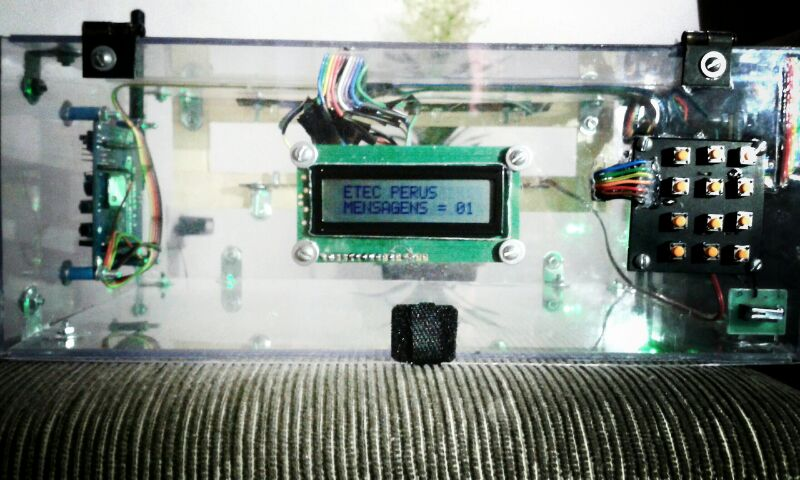

# CIE - Caixa de Correspondência Inteligente Eletrônica 

Software desenvolvido para um projeto de TCC do curso de Eletrônica.

## Descrição
CIE é um prototico de uma caixa de correspondencia inteligente que lhe 
envia uma mensagem SMS no seu celular sempre que chegar uma carta em sua 
casa.

## Principais Técnologias utilizadas

- Linguagem de programação C
-  Arduino Shield Modulo GSM SIM900
- Microcontrolador Microchip PIC16F877A
- Sensores opticos IRLED
- Display LCD alfanumérico 16x2
